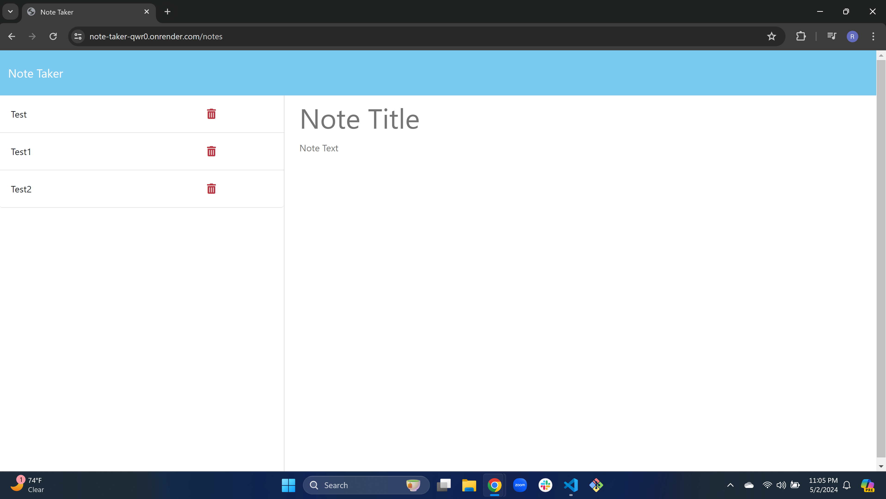
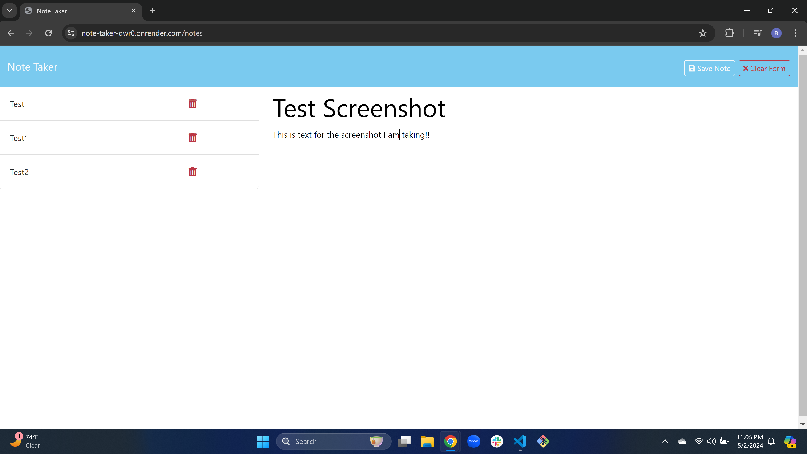
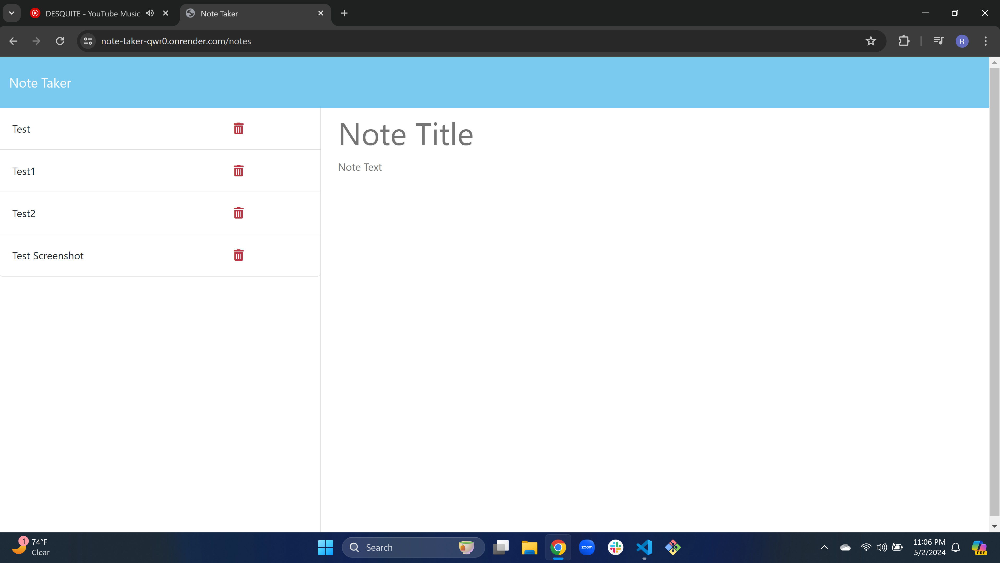

# Note_Taker
        
## Description

I was motivated in this challenge to have a page I can go to where I can take notes for class and daily reminiders in my life. The goal I wanted to complete was to be able to see previous notes by clicking on them, writing a new note and being able to delete old notes. I learned how to use helper functions that help me create a unique id for each note and another helper function that will help read the file, make the file and post it on the file. I also learned how to work with routes using GET and POST.

## Website Link

https://note-taker-qwr0.onrender.com
          
## Usage
  

          
## Questions
If you have any questions or need further clarification, you can reach me at [ryanhinson118@gmail.com](mailto:ryanhinson118@gmail.com) or visit my GitHub profile at [https://github.com/RyanH118](https://github.com/RyanH118).